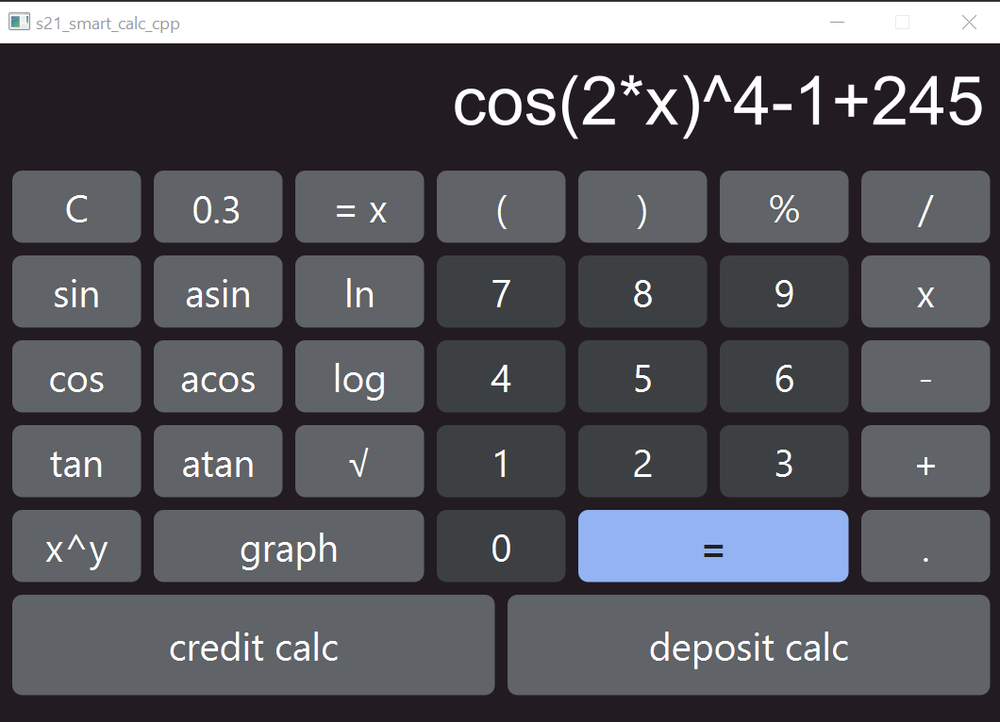

# SmartCalc v2.0

Implementation of SmartCalc v2.0 in C++ with additional features such as arithmetic expressions, mathematical functions, variable "X" support, and graph plotting. The project is built using the MVC template and includes loan and deposit calculators.



## Introduction

This project is implemented in C++ with a focus on object-oriented programming using the MVC template. It includes basic arithmetic operations, mathematical functions, and features like variable "X" support and graph plotting. The addition of loan and deposit calculators enhances its functionality.

## Part 1. Implementation of SmartCalc v2.0

- **Language:** C++ (C++17 standard).
- **Coding Style:** Google Style.
- **Namespace:** `s21`.
- **Testing:** Full coverage with GTest library.
- **Build System:** Makefile (all, install, remove, clean, etc.).
  - **Installation Commands:**
    ```bash
    make all         # Build the entire project
    make install     # Install the project
    make uninstall   # Uninstall the project
    make clean       # Clean the project files
    make tests       # Run tests
    ```
- **GUI:** Implemented using the Qt framework.
- **Design Pattern:** MVC.
- **Input:** Supports integers, real numbers (dot or exponential notation).
- **Calculation:** Triggered by entering "=" after completing the expression.
- **Expression Handling:** Supports arbitrary parenthetical arithmetic expressions in infix notation.
- **Graph Plotting:** Allows construction of graphical functions using expressions with "X" variables.
- **Scope:** Values limited from -1000000 to 1000000.
- **Accuracy:** Verified fractional part accuracy of at least 7 decimal places.
- **Character Limit:** Users can input up to 255 characters.
- **Arithmetic Operations:**
  
  | Operation | Infix | Prefix | Postfix |
  | --------- | ----- | ------ | ------- |
  | Parentheses | (a + b) | (+ a b) | a b + |
  | Addition | a + b | + a b | a b + |
  | Subtraction | a - b | - a b | a b - |
  | Multiplication | a * b | * a b | a b * |
  | Division | a / b | / a b | a b \ |
  | Exponentiation | a^b | ^ a b | a b ^ |
  | Remainder | mod b | mod a b | a b mod |
  | Unary plus | +a | +a | a+ |
  | Unary minus | -a | -a | a- |

  **Functions:**
  
  | Function | Description |
  | -------- | ----------- |
  | cos(x) | Computes cosine |
  | sin(x) | Computes sine |
  | tan(x) | Computes tangent |
  | acos(x) | Computes arc cosine |
  | asin(x) | Computes arc sine |
  | atan(x) | Computes arc tangent |
  | sqrt(x) | Computes square root |
  | ln(x) | Computes natural logarithm |
  | log(x) | Computes common logarithm |

## Part 2. Loan Calculator

- **Input:** Total loan amount, term, interest rate, type (annuity, differentiated).
- **Output:** Monthly payment, loan overpayment, total payments.


## Part 3. Deposit Calculator

- **Input:** Initial deposit, placement period, interest rate, payment frequency, interest capitalization, list of replenishments, list of partial withdrawals.
- **Output:** Accrued interest, tax amount, deposit amount by the end.


